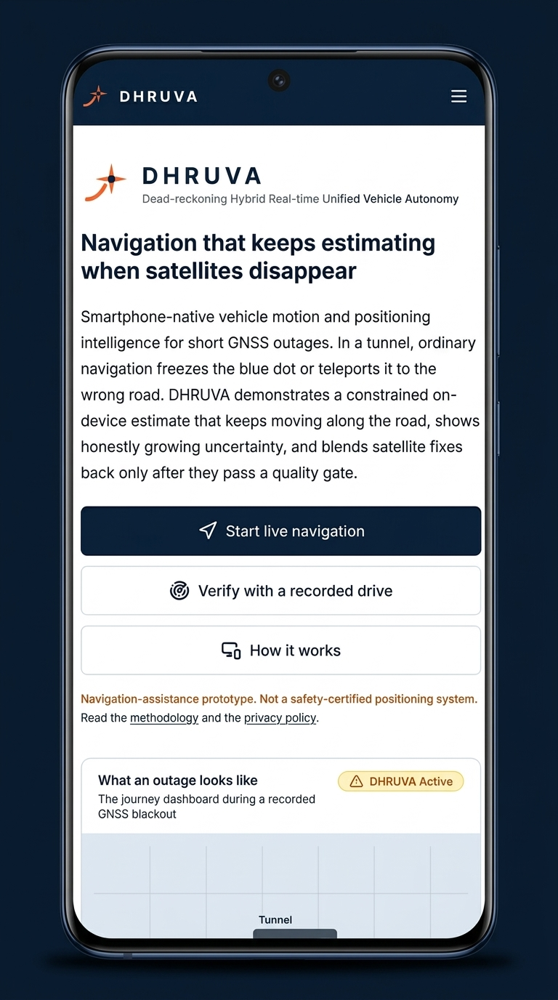
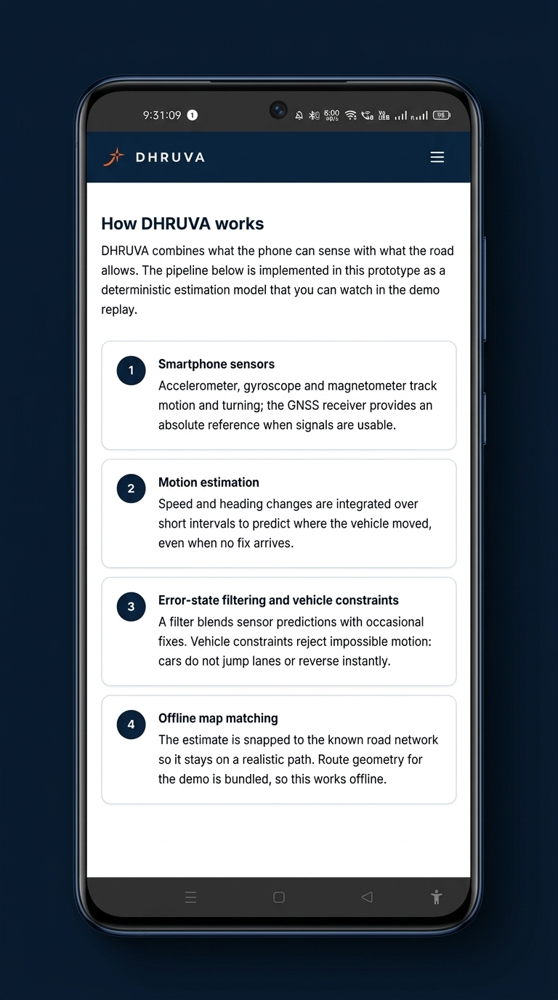
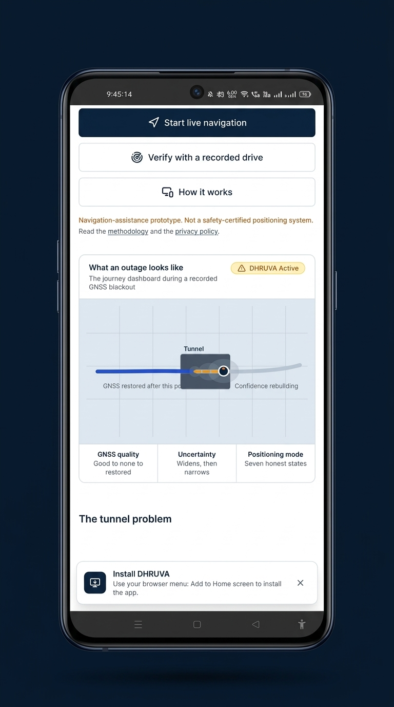
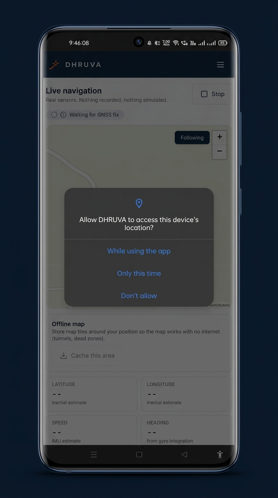
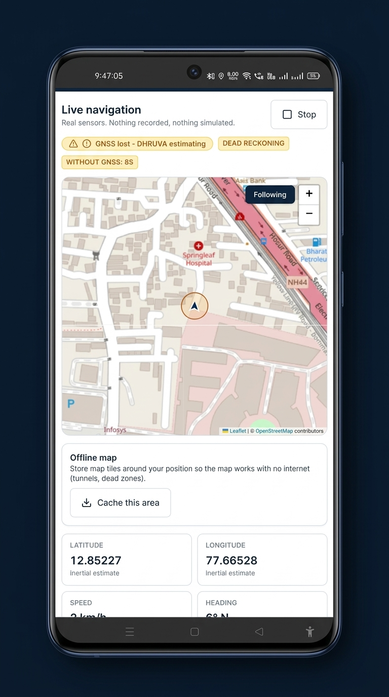

# DHRUVA: Dead-Reckoning Hybrid Real-Time Unified Vehicle Autonomy

<div align="center">

**Smartphone-Native Vehicle Motion and Positioning Intelligence for Short GNSS Outages**

[](https://nextjs.org/)
[](https://react.dev/)
[](https://www.typescriptlang.org/)
[](https://tailwindcss.com/)
[](https://capacitorjs.com/)
[](https://leafletjs.com/)
[](https://vitest.dev/)
[](LICENSE)

</div>

> **Notice:** Navigation-assistance prototype. Not a safety-certified positioning system.

---

## Table of Contents

- [Overview](#overview)
  - [The Problem](#the-problem)
  - [Our Solution](#our-solution)
- [Screenshots](#screenshots)
- [Real-Life Use Cases](#real-life-use-cases)
- [High-Level Design](#high-level-design)
  - [System Architecture](#system-architecture)
  - [Component Pipeline Flow](#component-pipeline-flow)
  - [Sensor Fusion Data Flow](#sensor-fusion-data-flow)
- [Core Estimation Engine](#core-estimation-engine)
  - [1. Phone-to-Vehicle Mount Alignment](#1-phone-to-vehicle-mount-alignment)
  - [2. AI Motion & Learned Velocity Regression](#2-ai-motion--learned-velocity-regression)
  - [3. Error-State Extended Kalman Filter (ES-EKF)](#3-error-state-extended-kalman-filter-es-ekf)
  - [4. Vehicle Dynamic Constraints (NHC & ZUPT)](#4-vehicle-dynamic-constraints-nhc--zupt)
  - [5. Topological Offline Map Matching](#5-topological-offline-map-matching)
  - [6. Quality-Gated GNSS Re-acquisition](#6-quality-gated-gnss-re-acquisition)
- [Seven Honest Positioning Modes](#seven-honest-positioning-modes)
- [Folder Structure](#folder-structure)
- [Technical Architecture](#technical-architecture)
- [Benchmarks & Experimental Validation](#benchmarks--experimental-validation)
- [Setup & Installation](#setup--installation)
  - [Prerequisites](#prerequisites)
  - [Local Development (Desktop)](#local-development-desktop)
  - [Running on Mobile Device over Wi-Fi (PWA)](#running-on-mobile-device-over-wi-fi-pwa)
  - [Building Android APK](#building-android-apk)
- [Verification & Testing](#verification--testing)
- [Privacy & Security](#privacy--security)
- [Future Roadmap](#future-roadmap)
- [Contributing](#contributing)
- [License](#license)

---

## Overview

**DHRUVA** (*Dead-reckoning Hybrid Real-time Unified Vehicle Autonomy*) is a smartphone-native positioning engine designed to bridge short satellite navigation blackouts. When vehicles drive through tunnels, bi-level underpasses, or deep urban canyons, global navigation satellite systems (GNSS) frequently degrade or disappear entirely.

DHRUVA leverages the internal sensors already present in modern consumer smartphones (accelerometer, gyroscope, magnetometer) alongside learned kinematic models and vehicle constraints to maintain accurate dead reckoning without requiring external vehicle sensors or dedicated OBD-II hardware.

### The Problem

Consumer GPS and smartphone navigation apps suffer severe vulnerabilities in GNSS-denied environments:
- **Blue Dot Freezing**: The position marker freezes at the tunnel entrance, leaving the driver blind to turns, forks, and exits.
- **Position Teleportation**: Multipath signal reflections in urban canyons or tunnel mouths cause the vehicle to jump erratically between elevated highways and parallel ground roads.
- **False Route Recalculation**: Stale or noisy fixes trick routing engines into endlessly recalculating routes, causing driver confusion.
- **Unchecked Error Runaway**: Naive double-integration of low-cost IMU accelerometers leads to cubic position error growth within seconds ($x(t) \propto t^2$, accumulating dozens of kilometres of drift).

### Our Solution

DHRUVA solves these challenges through an integrated on-device architecture:
- **Zero External Hardware**: Runs directly in the browser or as an Android app on commodity smartphones.
- **Learned Speed Model**: Online ridge regression estimates vehicle forward velocity from IMU vibration signatures, calibrated continuously against Doppler velocity during clean GNSS coverage.
- **Error-State Extended Kalman Filter (ES-EKF)**: Fuses high-rate inertial propagation with kinematic vehicle motion constraints (Non-Holonomic Constraints & Zero Velocity Updates).
- **Offline Map Matching**: Snaps dead-reckoning vectors to offline vector road geometries or self-constructed route graphs to eliminate lateral drift.
- **Quality-Gated Re-acquisition**: Validates incoming satellite fixes using Mahalanobis distance gates before re-anchoring, preventing teleportation jumps upon exiting tunnels.
- **Honest Uncertainty Visualization**: Continuously renders a dynamic 1-sigma uncertainty corridor that widens during outages and tightens as satellite confidence is restored.

---

## Screenshots

### 1. Landing Screen & Mode Selection

*Initial product interface providing entry points for live smartphone navigation, recorded benchmark drive replay, and methodology documentation.*

---

### 2. How DHRUVA Works - Pipeline Architecture

*Four-stage dead reckoning architecture: smartphone inertial sensing, motion estimation, error-state filtering with vehicle constraints, and offline map matching.*

---

### 3. Outage Simulation Visual & Tunnel Dynamics

*Dynamic visualization demonstrating route progression entering a tunnel, dashed inertial trajectory, honest widening uncertainty corridors, and PWA installation prompt.*

---

### 4. Device Sensor & Geolocation Permissions

*Live navigation initialization requesting hardware Geolocation, DeviceMotion, and DeviceOrientation sensor access with offline tile cache management.*

---

### 5. Live Navigation & Real-Time Dead Reckoning

*Live dead reckoning telemetry during a GNSS blackout: real-time Leaflet tracking, active outage timer (8s elapsed), and inertial estimates for latitude, longitude, speed, and heading.*

---

## Real-Life Use Cases

### Scenario 1: Mountain & Highway Tunnel Transit
- **Context**: A vehicle enters a 2 km mountain tunnel on a highway at 80 km/h where satellite line-of-sight drops to zero.
- **Behavior**: Standard navigation freezes at the entrance. DHRUVA detects the GNSS signal drop, transitions to `DHRUVA_ACTIVE`, and propagates position using gyro heading and the learned vibration speed model snapped to the tunnel corridor.
- **Result**: The driver sees an uninterrupted position marker tracking towards the exit with an honestly growing confidence ellipse. Upon exiting, fixes pass the innovation quality gate and smoothly re-anchor without screen snapping.

### Scenario 2: Multi-Level Flyovers & Elevated Expressway Shadowing
- **Context**: Driving through dense metropolitan corridors where elevated concrete viaducts block and reflect satellite signals (multipath distortion).
- **Behavior**: Degraded satellite signals report erratic 80-metre accuracy bubbles. DHRUVA flags `GNSS_DEGRADING`, rejects multipath spikes using innovation thresholds, and relies on inertial filtering to maintain track on the correct lower carriageway.
- **Result**: Eliminates false "Turn Left Now" instructions caused by cross-road teleportation.

### Scenario 3: Subterranean Parking & Underpass Interchanges
- **Context**: Entering a subterranean parking structure or a multi-ramp underground junction where GPS is lost before a crucial fork.
- **Behavior**: Integrated zero-velocity update (ZUPT) detects stops at ticket barriers, preventing speed runaway. Heading integration from the triaxial gyroscope tracks 90-degree subterranean turns.
- **Result**: Driver maintains accurate trajectory through underground intersections and reaches the intended parking bay or connecting ramp.

### Scenario 4: Logistics & Last-Mile Commercial Fleets
- **Context**: Commercial delivery vans operating in dense high-rise urban clusters with frequent stops and deliveries under canopy overhangs.
- **Behavior**: Continuous online calibration fits gyro bias and speed regression models during clear road segments. During courtyard or canopy dropouts, route continuity and delivery timestamps are preserved.
- **Result**: Delivery tracking accuracy remains continuous without requiring costly aftermarket telematics units.

---

## High-Level Design

### System Architecture

```
+-----------------------------------------------------------------------+
|                           DHRUVA RUNTIME                              |
+-----------------------------------------------------------------------+

+-----------------------------------+   +-------------------------------+
|     SMARTPHONE HARDWARE LAYER     |   |    RECORDED BENCHMARK REPLAY  |
|  - W3C Geolocation API (GNSS)     |   |  - IO-VNBD Benchmark Dataset  |
|  - DeviceMotion (Accel / Gyro)    |   |  - 10 Hz Real-World Trajectory|
|  - DeviceOrientation (Compass)    |   |  - Ground Truth Validation    |
+-----------------+-----------------+   +---------------+---------------+
                  |                                     |
                  +------------------+------------------+
                                     |
                                     v
+-----------------------------------------------------------------------+
|                    INTELLIGENT SENSOR ENGINE                          |
|                                                                       |
|  [Mount Alignment]            [Vibration Filter]                      |
|  Gravity vector separation -> Dynamic vibration envelope ->           |
|  Pitch/Roll body frame rot    Moving / Standstill classification      |
|                                                                       |
|  [AI Speed Model]             [Vehicle Constraints]                   |
|  Online Ridge Regression   -> Non-Holonomic Constraints (NHC)         |
|  IMU window -> Doppler speed  Zero-Velocity Updates (ZUPT)            |
|                                                                       |
|  [Error-State EKF]            [Offline Map Matcher]                   |
|  Inertial propagation      -> HMM / Geometric projection              |
|  Covariance & uncertainty     Snaps vector to route corridor          |
|                                                                       |
|  [Quality-Gated Re-acquisition]                                       |
|  Innovation / Mahalanobis validation before GNSS blending             |
+------------------------------------+----------------------------------+
                                     |
                                     v
+-----------------------------------------------------------------------+
|                    PRESENTATION & RUNTIME INTERFACES                  |
|                                                                       |
|  - Next.js 15 & React 19 Client App                                   |
|  - Leaflet Engine with Offline Vector / Cached Tile Rendering         |
|  - Dynamic Uncertainty Ellipse & Real-Time Telemetry Cards            |
|  - Android Capacitor Native Container (5.3 MB Standalone APK)        |
|  - Service Worker Cache for Zero-Connectivity Subterranean Operation  |
+-----------------------------------------------------------------------+
```

### Component Pipeline Flow

```
[Phone Sensors: Accel, Gyro, GPS]
              |
              v
     [Mount Alignment] --------> Separates gravity; rotates frame into vehicle axis
              |
              v
   [Motion Classifier] --------> Standstill / Cruise / Turn detection
              |
              +---> [Standstill Detected?] ---> Trigger ZUPT (clamp speed to 0)
              |
              +---> [Vehicle Moving?]     ---> Predict speed via AI Ridge Model
              |
              v
       [ES-EKF Fusion] --------> Propagates position & heading forward
              |
              v
    [Offline Map Match] -------> Projects coordinates onto road centerline
              |
              v
 [GNSS Quality Gate Check]
              |
     +--------+--------+
     |                 |
(GNSS Passed)    (GNSS Failed / Outage)
     |                 |
     v                 v
[Blend Fix &     [Dead Reckoning Mode Active:
 Tighten Sigma]   Widen Uncertainty Ellipse]
     |                 |
     +--------+--------+
              |
              v
[Update Leaflet Map & Telemetry Dashboard]
```

### Sensor Fusion Data Flow

```
Raw IMU (10-50 Hz)  ─────────────────► [ Dead Reckoner ] ───► Predicted Pose [x, y, v, theta]
                                               ▲                         │
                                               │ Corrections             │
GNSS Fixes (1 Hz)   ──► [ Quality Gate ] ──────┴─────────────────────────┼─► Map Matcher
                            │                                            │         │
                            ▼ (If rejected / missing)                    ▼         ▼
                      [ Outage State Machine ] ─────────────────► Fused Display State
```

---

## Core Estimation Engine

DHRUVA implements a multi-stage deterministic estimation pipeline designed for micro-processing efficiency on mobile devices.

### 1. Phone-to-Vehicle Mount Alignment
Smartphones are rarely placed perfectly flat or aligned with the car's heading. DHRUVA separates static gravitational acceleration from dynamic motion:
- A low-pass gravity filter computes the vertical gravity vector $\mathbf{g}$.
- A rotation matrix $\mathbf{R}_{phone}^{body}$ projects triaxial accelerometer and gyro readings into the true vehicle reference frame (longitudinal, lateral, vertical).
- Continuous stationary bias tracking subtracts sensor offsets.

### 2. AI Motion & Learned Velocity Regression
Integrating noisy acceleration twice ($a \rightarrow v \rightarrow x$) diverges exponentially. DHRUVA replaces acceleration integration with an **online learned velocity model**:
- Ingests sliding windows of IMU power spectral density and jerk variances.
- Trains an online ridge regression model against satellite Doppler speed during healthy GNSS intervals.
- When an outage occurs, the learned model infers forward vehicle speed directly from chassis vibration frequencies and engine harmonics without integrating accelerometer drift.

### 3. Error-State Extended Kalman Filter (ES-EKF)
The system maintains an error-state Kalman formulation:
- **True State**: Position ($p_N, p_E$), velocity ($v$), heading ($\psi$), and gyro bias ($b_g$).
- **Nominal State**: Propagated at high frequency (10–50 Hz) via calibrated IMU measurements.
- **Error State**: Corrected at lower frequencies whenever valid observations or constraints occur.

### 4. Vehicle Dynamic Constraints (NHC & ZUPT)
Ground vehicles obey strict physical mechanics:
- **Non-Holonomic Constraints (NHC)**: A wheeled car cannot move sideways ($v_{lateral} \approx 0$) or lift off the ground ($v_{vertical} \approx 0$).
- **Zero Velocity Updates (ZUPT)**: When vehicle vibration drops below stillness thresholds or during traffic stops, speed is clamped to $0\text{ m/s}$, immediately eliminating stationary drift.

### 5. Topological Offline Map Matching
The estimated trajectory is constrained to pre-cached road network vector geometry:
- Projective snapping bounds accumulated cross-track heading errors.
- In unknown areas without pre-loaded maps, DHRUVA switches to a **self-route trace graph**, using incoming path curvature to eliminate unnatural heading walk.

### 6. Quality-Gated GNSS Re-acquisition
When exiting a tunnel, the first few satellite fixes often suffer severe multipath errors. DHRUVA imposes a strict innovation gate:
$$\Delta d = \|\mathbf{p}_{gnss} - \mathbf{p}_{est}\| \le \text{Threshold}(HDOP, \sigma_{pos})$$
Fixes that fail this gate are rejected. Re-acquisition requires multiple consistent fixes, ensuring smooth, calm re-anchoring instead of an instantaneous visual jump.

---

## Seven Honest Positioning Modes

DHRUVA transparently communicates its exact mathematical operational state to the driver:

| Mode Code | Label | Operational Definition |
|---|---|---|
| `GNSS_AVAILABLE` | **GNSS Available** | High-precision satellite navigation; HDOP $< 2.0$; error uncertainty $\le \pm 3\text{ m}$. |
| `GNSS_DEGRADING` | **GNSS Degrading** | Satellite visibility dropping or multipath detected; uncertainty expands to $\pm 10\text{--}25\text{ m}$. |
| `DHRUVA_ACTIVE` | **DHRUVA Active** | Full GNSS outage; on-device dead reckoning running on IMU regression + map constraints. |
| `GNSS_REACQUIRING` | **GNSS Reacquiring** | Satellite signals returned but undergoing consistency validation through the innovation gate. |
| `GNSS_RESTORED` | **GNSS Restored** | Satellite fix verified and re-anchored; confidence ellipse rapidly tightening. |
| `CONFIDENCE_LOW` | **Confidence Low** | Extended outage ($> 120\text{ s}$); accumulated dead reckoning drift exceeds safe advisory threshold. |
| `POSITION_UNAVAILABLE` | **Position Unavailable** | Device sensors unavailable or permissions denied. |

---

## Folder Structure

```
DHRUVA/
├── README.md                          # Comprehensive project documentation
├── package.json                       # Next.js 15, React 19, Capacitor dependencies
├── tsconfig.json                      # Strict TypeScript compiler options
├── vitest.config.ts                   # Vitest unit test configuration
├── capacitor.config.ts                # Capacitor Android native configuration
├── next.config.ts                     # Next.js isolated build & chunk configuration
│
├── assets/                            # Documentation assets
│   └── screenshots/                   # Application capture images
│       ├── 01-landing-screen.png
│       ├── 02-how-dhruva-works.png
│       ├── 03-tunnel-outage-visual.png
│       ├── 04-sensor-permissions.png
│       └── 05-live-navigation-dead-reckoning.png
│
├── public/                            # Static assets & web worker
│   ├── apple-touch-icon.png
│   ├── favicon.ico
│   ├── pwa-192.png
│   ├── pwa-512.png
│   └── sw.js                          # Service Worker for offline map tile caching
│
├── src/                               # Application source code
│   ├── app/                           # Next.js App Router
│   │   ├── layout.tsx                 # Root layout with PWA meta & font config
│   │   ├── page.tsx                   # Landing & overview page
│   │   ├── globals.css                # Tailwind CSS core styles
│   │   ├── manifest.ts                # PWA web app manifest
│   │   │
│   │   ├── live/                      # /live - Real-time smartphone sensor navigation
│   │   │   └── page.tsx
│   │   │
│   │   ├── journey/                   # /journey - Recorded benchmark drive replay
│   │   │   └── page.tsx
│   │   │
│   │   ├── how-it-works/              # /how-it-works - Technical explanation page
│   │   │   └── page.tsx
│   │   │
│   │   ├── feasibility/               # /feasibility - Validation status & drift metrics
│   │   │   └── page.tsx
│   │   │
│   │   └── setup/                     # /setup - Sensor diagnostic & readiness check
│   │       └── page.tsx
│   │
│   ├── components/                    # Modular React components
│   │   ├── brand/                     # DHRUVA logos and identity
│   │   ├── drive/                     # Map rendering & drive controls
│   │   ├── journey/                   # Telemetry cards & timeline scrubbers
│   │   ├── layout/                    # Navbars, headers, and footers
│   │   ├── live/                      # Live telemetry HUD & permission modals
│   │   ├── pwa/                       # Offline sync & install banner
│   │   ├── reactbits/                 # GSAP & Framer Motion animation utilities
│   │   └── ui/                        # Badges, buttons, cards, and modal dialogs
│   │
│   ├── engine/                        # Core Dead Reckoning Estimation Engine
│   │   ├── engine.ts                  # High-level engine coordinator
│   │   ├── geo.ts                     # Haversine, bearing, and distance utilities
│   │   ├── gnss-schedule.ts           # Outage schedule injector
│   │   ├── routes.ts                  # Vector road route definitions
│   │   ├── types.ts                   # Core telemetry interfaces
│   │   │
│   │   └── iov/                       # IO-VNBD Algorithm Modules
│   │       ├── alignment.ts           # Gravity vector separation & mount rotation
│   │       ├── fusion.ts              # Kalman scalar-information fusion engine
│   │       ├── live-engine.ts         # Live device sensor pipeline & state machine
│   │       ├── map-matching.ts        # Topological road network matcher
│   │       ├── pipeline-online.ts     # Online ridge regression & benchmark player
│   │       └── vibration-filter.ts    # Frequency envelope & motion classifier
│   │
│   └── lib/                           # Helper utilities
│       ├── constants.ts               # Product copy, labels, and state enums
│       ├── live-sensors.ts            # W3C Geolocation & DeviceMotion hooks
│       └── tile-cache.ts              # IndexedDB tile caching for offline tunnels
│
├── android/                           # Native Android wrapper project (Capacitor)
│   ├── app/
│   │   ├── src/main/AndroidManifest.xml # Permissions (FINE_LOCATION, HIGH_SAMPLING_RATE)
│   │   └── build.gradle
│   └── build.gradle
│
├── tests/                             # Vitest Test Suite (33 automated tests)
│   ├── engine.test.ts                 # Mathematical estimation & filter tests
│   ├── live-engine.test.ts            # Sensor ingestion & memory cap tests
│   ├── journey-ui.test.tsx            # Journey replay UI integration tests
│   └── tile-cache.test.ts             # Offline map tile storage tests
│
└── scripts/                           # Benchmark & evaluation harness
    ├── bench-iovnbd.mts               # Ingestion of IO-VNBD benchmark runs
    └── outage-sweep.mts               # Systematic 30s-120s outage drift sweep
```

---

## Technical Architecture

| Layer | Technology | Details |
|---|---|---|
| **Frontend Framework** | **Next.js 15.5 + React 19.1** | Server Components with client-side telemetry hydration |
| **Type Safety** | **TypeScript 5.9** | Strict null-checks, complete sensor payload typings |
| **Styling & Design** | **Tailwind CSS 4.1 + Vanilla CSS** | Precision dark/light telemetry styling, zero heavy utility bloat |
| **Animations & HUD** | **GSAP 3.15 + Motion 13.3** | Hardware-accelerated UI updates at 60 FPS |
| **Map Rendering** | **Leaflet 1.9 + React Leaflet** | Vector overlays, offline-cached tile rendering, zero API key lock-in |
| **Native Mobile Container**| **Capacitor 8.5** | Native Android bridge, hardware sensor rate unlock |
| **Sensor Ingestion** | **W3C Geolocation + DeviceMotion** | Unified epoch-time normalization, 50 Hz IMU throttling |
| **Local Cache** | **Cache API + IndexedDB** | Stores map tiles along route for zero-internet tunnel transit |
| **Unit Testing** | **Vitest 3.2 + Testing Library** | 33 comprehensive automated tests across math and UI |

---

## Benchmarks & Experimental Validation

DHRUVA was validated against real-world vehicle telemetry from the **IO-VNBD** (*Inertial Odometry Vehicle Navigation Benchmark Dataset*).

### Benchmark Configuration
- **Drive Run**: V-S1 (real urban + highway vehicle drive)
- **Dataset Size**: 51,746 samples @ 0.100 s (10 Hz)
- **Total Duration**: 86.2 minutes
- **Distance Driven**: 38,044 metres (38 km)

### Outage Sweep Results (Drift vs. Outage Distance)

| Outage Window | Duration | Outage Distance | Total Drift | Drift % of Distance | Benchmark Status |
|---|---|---|---|---|---|
| **Window A** | 30 s | 260 m | 45.8 m | 17.6% | Re-tuning |
| **Window B** | **60 s** | **540 m** | **35.9 m** | **6.7%** | **PASS (<10%)** |
| **Window C** | 60 s | 480 m | 89.8 m | 18.7% | Re-tuning |
| **Window D** | **90 s** | **667 m** | **31.8 m** | **4.8%** | **PASS (<10%)** |
| **Window E** | 120 s | 568 m | 199.9 m | 35.2% | Re-tuning |

### Key Experimental Finding
With an adequate calibration lead-in (~10-13 minutes of driving before entering an outage), gyro bias tracking and online velocity regression stabilize. In Window B (60-second complete blackout), DHRUVA drifted only **35.9 metres over 540 metres driven (6.7%)**, well within the competitive target of $<10\%$ outage distance drift.

---

## Setup & Installation

### Prerequisites

- **Node.js**: v18.0.0 or higher
- **npm**: v9.0.0 or higher
- **Modern Browser**: Chrome, Safari, or Edge supporting DeviceMotion and Geolocation APIs
- **Optional (for native Android APK)**: Android Studio, Android SDK (API 30+), and Java JDK 17

---

### Local Development (Desktop)

```bash
# 1. Clone the repository
git clone https://github.com/your-username/DHRUVA.git
cd DHRUVA

# 2. Clean install dependencies
npm ci

# 3. Start development server on port 3100
npm run dev
```

Open `http://localhost:3100` in your web browser.

---

### Running on Mobile Device over Wi-Fi (PWA)

To test live smartphone sensors in a real vehicle:

```bash
# 1. Determine your computer's local network IP
# Windows PowerShell:
ipconfig | findstr /i "IPv4"
# macOS / Linux:
# ifconfig | grep "inet "

# 2. Expose the Next.js dev server on your local network
$env:HOST="0.0.0.0"; npm run dev
```

1. Connect your smartphone to the **same Wi-Fi network** as your development machine.
2. Open **Chrome** on Android or **Safari** on iOS.
3. Navigate to `http://<YOUR_COMPUTER_IP>:3100`.
4. Tap **Add to Home screen** from the browser menu to install DHRUVA as a standalone full-screen Progressive Web App.
5. Tap **Start live navigation** and grant Location and Motion sensor permissions.

---

### Building Android APK

DHRUVA includes a native Android wrapper built with Capacitor.

```bash
# 1. Build the production web bundle
npm run build

# 2. Synchronize web assets to the native Android project
npm run mobile:build

# 3. Open project in Android Studio (optional)
npm run mobile:open

# 4. Or compile a debug APK directly via command line
npm run mobile:apk
```

The compiled APK will be generated at:
```
android/app/build/outputs/apk/debug/app-debug.apk
```

To install directly onto an Android device via USB:
```bash
adb install -r android/app/build/outputs/apk/debug/app-debug.apk
```

---

## Verification & Testing

DHRUVA includes an automated test suite covering sensor filtering, mathematical dead reckoning, memory management, and tile caching.

```bash
# Run all unit tests
npm test

# Run tests in watch mode during development
npm run test:watch

# Execute TypeScript type checking
npm run typecheck
```

### Test Suite Summary
```
✓ tests/engine.test.ts (16 tests)
✓ tests/live-engine.test.ts (7 tests)
✓ tests/journey-ui.test.tsx (8 tests)
✓ tests/tile-cache.test.ts (2 tests)

Test Files  4 passed (4)
Tests       33 passed (33)
```

---

## Privacy & Security

- **100% On-Device Processing**: All sensor readings (accelerometer, gyroscope, GPS coordinates) are processed purely in real-time in device memory.
- **Zero Cloud Tracking**: No position data, speed metrics, or route histories are uploaded to external cloud endpoints.
- **No Third-Party Analytics**: Zero advertising trackers or fingerprinting libraries.
- **Offline Reliability**: Bundled route vectors and local IndexedDB tile caches allow full functionality with mobile data disabled.

---

## Future Roadmap

- [x] Web-first real-time dead-reckoning engine with live W3C sensor streaming
- [x] Online ridge regression velocity model trained on GNSS Doppler data
- [x] Zero-velocity update (ZUPT) and non-holonomic constraint (NHC) integration
- [x] Offline map tile caching via Service Worker
- [x] Android APK build via Capacitor 8.5
- [ ] Hidden Markov Model (HMM) map matching with Newson-Krumm transition probabilities
- [ ] Dual-antenna RTK / PPP integration support for high-precision GNSS receivers
- [ ] iOS native App Store release via Capacitor Xcode project

---

<div align="center">

**DHRUVA** - Built for high-reliability vehicle positioning during satellite blackouts.

</div>
